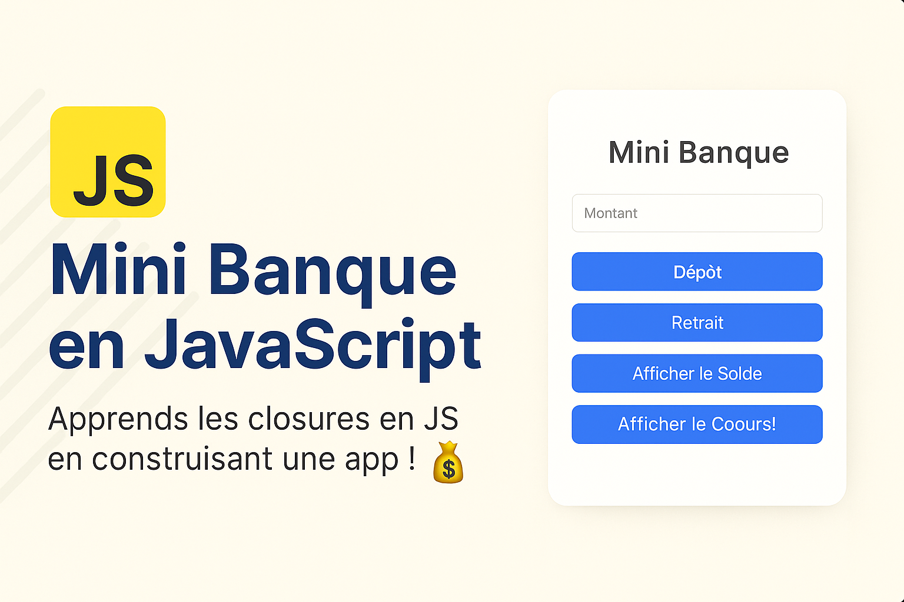

# 💳 Mini Banque - Application Web

Une petite application bancaire en JavaScript pur qui m’a permis de consolider mes compétences en DOM, validation de formulaires, logique métier, et closures. Conçue pour être simple, éducative, et interactive. 💡

---

## 🚀 Objectifs pédagogiques

Ce projet a été conçu pour :
- Renforcer la compréhension des **fonctions JavaScript**
- Maîtriser la notion **de closure** (fermeture lexicale)
- Implémenter un **système d’état privé** dans une application
- Pratiquer la **manipulation du DOM**
- Améliorer le **design UX/UI** avec CSS moderne et animations

---

## 🧠 Concepts abordés

- **Closures en JavaScript** : pour encapsuler et sécuriser les données (`balance`, `history`)
- **Validation des entrées** utilisateur avec gestion des erreurs
- **Fonctions pures et immutabilité** (retour d’un historique cloné)
- **Animation CSS** pour une interface plus agréable
- **Modularité** et bonnes pratiques de structuration du code

---

## 🚀 Fonctionnalités
- 💰 Dépôt d’argent
- 💸 Retrait avec vérification du solde
- 📊 Affichage du solde actuel
- 📜 Historique des transactions
- ✅ Validation robuste des entrées
- ✨ Interface animée et moderne

---

## 🧠 Ce que j’ai appris
- Les **closures** en JavaScript à travers la gestion privée du solde
- La manipulation du DOM pour des interactions dynamiques
- Le design UI minimaliste et éducatif

---

## 📂 Technologies utilisées

- HTML5
- CSS3 (design moderne + animations)
- JavaScript (Vanilla JS – sans framework)

---

## 🚧 Prochaines améliorations (optionnel)

- Authentification simple
- Export de l’historique (CSV / JSON)
- Passage vers React.js + backend Node.js (API)

---

## 🧑‍💻 Auteur

Conçu et codé avec passion par [ABDOULAYE TRAORE] dans le cadre de mon apprentissage approfondi de JavaScript.

---

## 📬 Contact

[LinkedIn](https://www.linkedin.com/in/abdoulaye-traore-73928924a/) – [Email](atraore1703@gmail.com)

---
